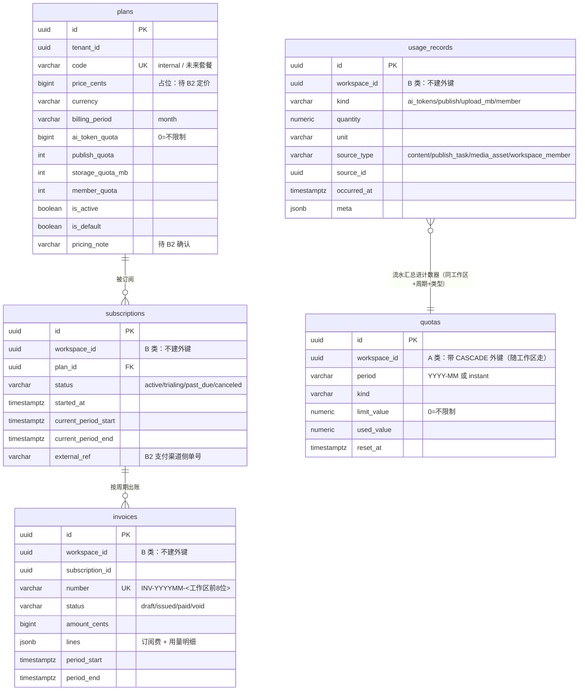

# B0.7 设计：计费 / 订阅 / 配额

- 日期：2026-09-21
- 范围：**只做表结构与通用配额逻辑**，不做定价决策（定价模型与目标市场属业务决策，待 B2）
- 结论：5 张表 + 配额闸门 + 用量流水 + 草稿账单 + 支付接口占位均已落地，接口级验证 5/5 通过

## 一、数据模型（ER 图）

**外键取舍**（与 B0.4 三分类一致）：

| 表 | 是否随工作区删除 | 理由 |
| --- | --- | --- |
| `plans` | 否（平台级字典） | 与 `roles` 同类：全局字典，**不继承 BaseEntity**（没有 `workspace_id` 列；继承会导致 TypeORM 查不存在的列） |
| `subscriptions` / `usage_records` / `invoices` | **否** | 计费事实与发票是法律凭据（B 类账本），工作区被清除后仍须保留 → **刻意不加**指向 `workspaces` 的外键 |
| `quotas` | **是** | 只是周期计数器（快路径），工作区没了它没有意义 → 迁移里带 `CASCADE` 外键 |

## 二、配额口径

| 类型 | 口径 | 用量来源 | 上限取自 |
| --- | --- | --- | --- |
| `ai_tokens` | 按自然月累计 | 每次 AI 调用后记录 input+output token | 计划 `ai_token_quota` |
| `publish` | 按自然月累计 | 每个发布任务记录 1 次 | 计划 `publish_quota` |
| `upload_mb` | **瞬时**（当前素材总大小） | 上传成功后记录本次 MB | 计划 `storage_quota_mb` |
| `member` | **瞬时**（当前成员数） | 新增成员时记录 1 次 | 计划 `member_quota` |

- **0 = 不限制**：内部部署用的默认计划 `internal` 全部为 0，因此现有行为完全不变；
- 上限来源：`工作区的有效订阅 → 计划`；没有订阅则用 `is_default` 的计划；
- 超限：抛 **403**，文案包含"哪项配额、已用多少、上限多少、何时重置、当前计划"，并写审计 `quota.exceeded`；
- 流水（`usage_records`）是**事实来源**，计数器（`quotas`）只是快路径；流水写入失败不影响业务主流程，但会记 error 日志。

## 三、调用点（闸门 + 用量记录）

| 业务动作 | 代码位置 | 闸门 | 记录 |
| --- | --- | --- | --- |
| AI 调用 | `apps/api/src/modules/ai/ai.service.ts`（`assertWithinQuota`） | `assertQuota('ai_tokens', 1)`（与既有"每分钟频率/每日 token"额度并存） | 调用成功后按实际 token 记录 |
| 创建发布任务 | `apps/api/src/publish/publish.service.ts:createTasks` | `assertQuota('publish', 1)` | 每个任务 1 次 |
| 上传素材 | `apps/api/src/modules/media/media.service.ts:upload` | `assertQuota('upload_mb', 本次MB)` | 上传成功后记录 |
| 新增工作区成员 | `apps/api/src/modules/workspace/workspace.service.ts:upsertMember` | `assertQuota('member', 1)`（只对**新增**生效，改角色不消耗） | 新增成功后记录 |

## 四、账单（草稿）与支付接口

- `POST /api/billing/invoices/draft?period=YYYY-MM`：按"订阅 → 计划"的价格生成一张**草稿**账单
  （编号 `INV-YYYYMM-<工作区前 8 位>`，同一周期唯一，重复调用返回同一张）；
- 不传周期时默认出**上一个自然月**（本月还没走完，账不该先出）；
- 明细行 = 订阅费（`price_cents`，目前为 0 占位）+ **用量事实行**（单价 0、金额 0，只记录用量，不参与计价）；
- 支付：`PaymentProvider` 接口 + `NoopPaymentProvider`（调用即抛"尚未接入支付渠道"），
  `GET /api/billing/payment-provider` 明确返回 `implemented: false`——**避免误以为能收款**。B2 实现该接口并注入即可。

## 五、接口清单

| 接口 | 能力点 | 说明 |
| --- | --- | --- |
| `GET /api/billing/plans` | 登录即可 | 套餐目录（含内部默认计划） |
| `GET /api/billing/quotas` | `workspace.manage` | 当前工作区 4 类配额的 上限/已用/剩余/重置时间/是否受限 |
| `GET /api/billing/subscription` | `workspace.manage` | 当前生效计划 + 订阅记录 |
| `POST /api/billing/invoices/draft` | `workspace.manage` | 生成/读取指定周期草稿账单 |
| `GET /api/billing/invoices` | `workspace.manage` | 本工作区账单列表 |
| `GET /api/billing/payment-provider` | 登录即可 | 支付渠道接入状态（当前未接入） |

## 六、测试证据

`apps/api/test/billing-quota.e2e.spec.ts`（5 条，全部通过）：

1. **发布次数配额**：测试计划上限 1 → 第 1 个任务 201 且 `usage_records` 有流水、`quotas.used_value = 1`；
   第 2 个任务（换平台）**403**，文案含"发布次数…上限 1"，审计 `quota.exceeded` 落库；
2. **配额接口**：`GET /billing/quotas` 显示 `limit=1 / unlimited=false / planCode=e2e-limit-*`；
3. **成员配额**（瞬时口径）：上限 2 → 第 2 个成员成功，第 3 个 **403**（文案含"成员数"），
   数据库确认第 3 个成员**没有被写进去**，`member` 流水存在；
4. **草稿账单**：按计划价格出账（0 元占位）、明细含用量行、重复调用不重复出账、
   不传周期时只为上月出账、每次出账都有审计；
5. **目录与支付**：`plans` 含 `internal` 与测试计划；支付渠道返回 `implemented: false` 且说明指向 B2。

## 七、遗留与不做项（明确交给 B2）

1. **定价**：`price_cents` 全为 0 占位；套餐划分、超额单价、试用期策略均为业务决策 → 待 B2。
2. **支付**：只有接口与空实现；不接任何支付网关、不做扣款、不做对账。
3. **开票/税费**：`invoices` 只有草稿状态流转（draft/issued/paid/void 字段已留），开票主体与税率待业务确认。
4. **用量聚合**：目前按"月"聚合；若将来要按"订阅周期（非自然月）"聚合，需要把 `quotas.period` 改为订阅周期标识。
5. **配额升级体验**：超限只给 403 与文案；自助升级入口（改订阅）待 B2 与套餐一起做。
